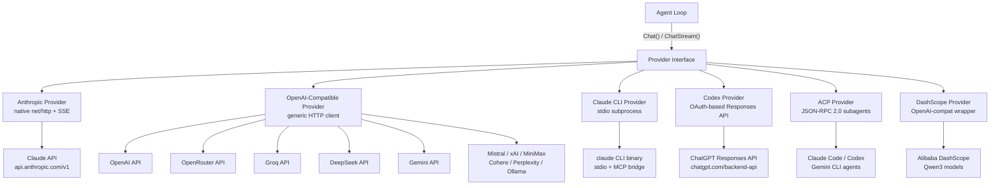
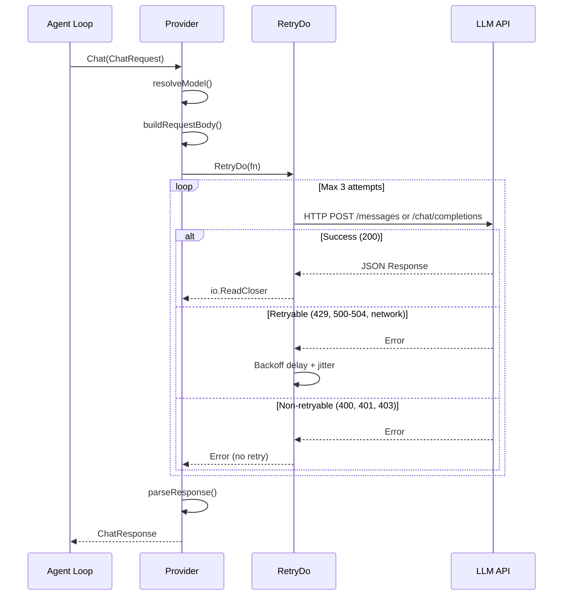
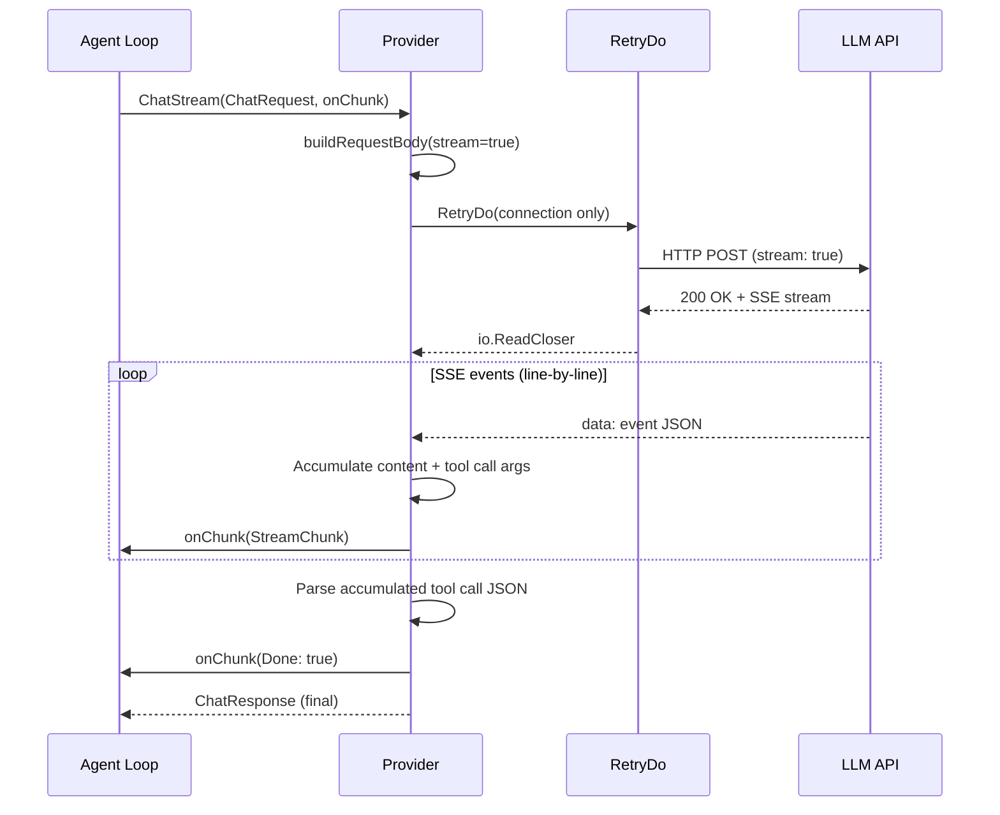
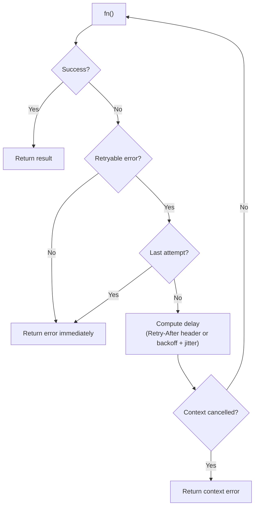
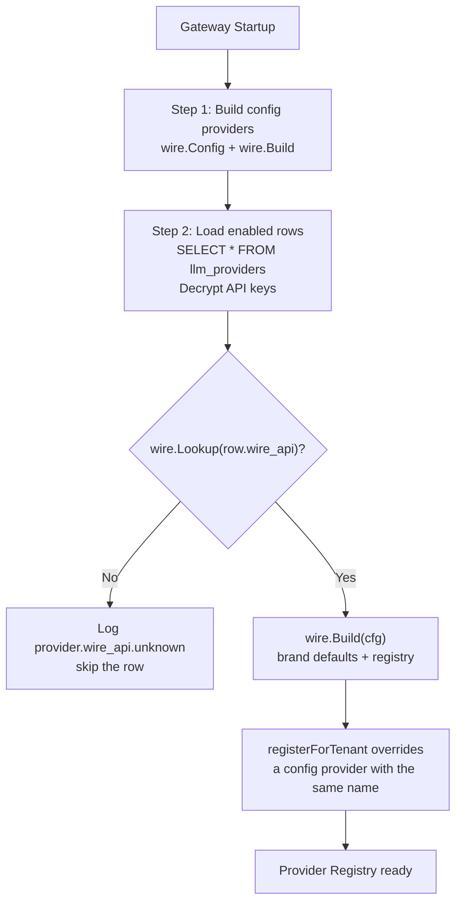
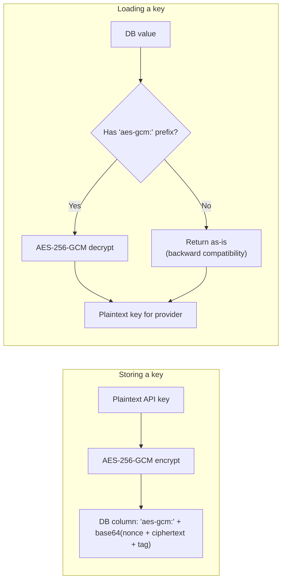
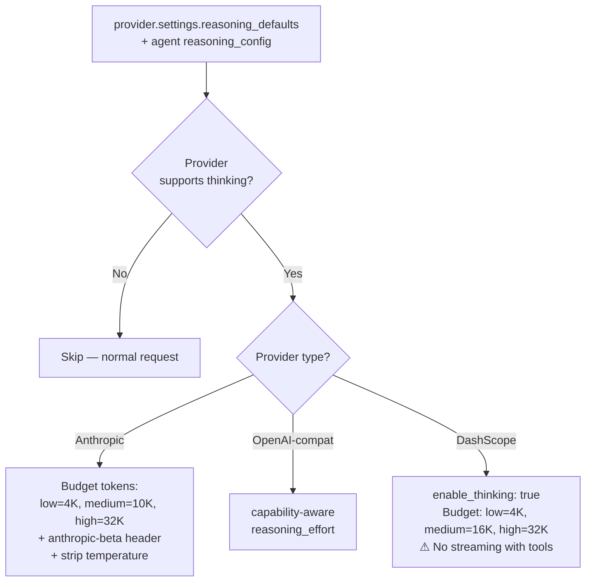
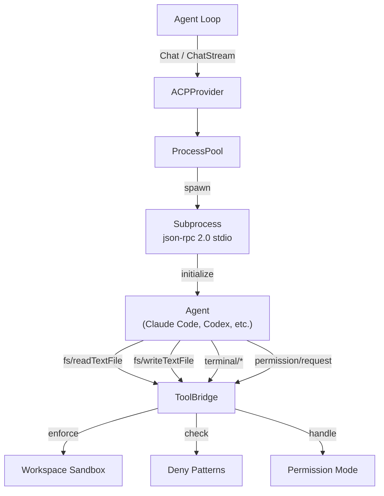
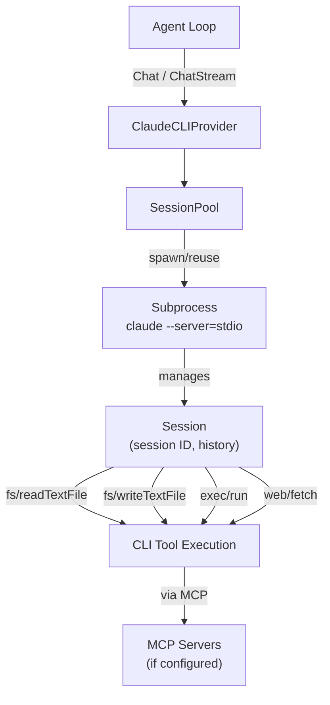

# 02 - LLM Providers

GoClaw abstracts LLM communication behind a single `Provider` interface, allowing the agent loop to work with any backend without knowing the wire format. The concrete transports are Anthropic (native HTTP+SSE), OpenAI-compatible (covering 10+ API endpoints), Claude CLI (local binary), Codex (OAuth-based), ACP (subagent orchestration), DashScope (Alibaba Qwen wrapper), Vertex AI, and native Ollama (`internal/providers/interfaces_guard_test.go:7-17`). The OpenAI-compatible transport also supports BytePlus ModelArk (Seed 2.0 models with image/video generation).

Which transport a provider gets is declared data, not a Go switch. `llm_providers.wire_api` names the wire protocol, `llm_providers.auth_kind` names the credential shape, and `provider_type` is only the brand label that supplies vendor defaults — base URL, default model, identity headers and the brand's construction quirks live in the brand table (`internal/providers/wire/brand.go`). Adding a provider of an existing brand is a row insert.

---

## 1. Provider Architecture

All providers implement four methods: `Chat()`, `ChatStream()`, `Name()`, and `DefaultModel()`. The agent loop calls `Chat()` for non-streaming requests and `ChatStream()` for token-by-token streaming. Both return a unified `ChatResponse` with content, tool calls, finish reason, and token usage.



### Declared wire protocol and credential shape

Every wire protocol registers a `Descriptor` in the dispatch registry, and that descriptor declares the credential carrier (`Descriptor.AuthHeaderStyle`), the request path (`Descriptor.ChatPath`), the environment fallback keys, and whether a credential is required (`Descriptor.RequiresAPIKey`). The table below is the registered set (`internal/providers/wire/build.go:11-122`).

| `wire_api` | `auth_kind` | Credential carrier | Chat path |
|---|---|---|---|
| `openai-completions` | `api_key` | `Authorization: Bearer` | `/chat/completions` |
| `openai-responses` | `api_key` | `Authorization: Bearer` | `/responses` |
| `openai-codex-responses` | `oauth_browser` | OAuth bearer (refreshed via `TokenSource`) | `/codex/responses` |
| `anthropic-messages` | `api_key` | `x-api-key` header | `/v1/messages` |
| `google-generative-ai` | `api_key` | `Authorization: Bearer` | `/chat/completions` |
| `google-vertex` | `service_account` | GCP OAuth2 (inline JSON, credentials file, or ADC) | `/chat/completions` |
| `ollama-native` | `none` | none (key optional) | `/api/chat` |
| `cli-delegated` | `cli_delegated` | stdio subprocess (no HTTP auth; the CLI/agent owns its own login) | — |

`openai-responses` is registered but has no transport in this build: `buildOpenAIResponses` returns an error telling the operator to declare `openai-codex-responses` for the ChatGPT/Codex flow, rather than silently downgrading the row to Chat Completions (`internal/providers/wire/build.go:153-158`).

`auth_kind` has a sixth accepted value, `none`, which is what keyless rows default to (`internal/providers/wire/api.go:41-48`). A row with an empty `auth_kind` derives it from the descriptor (`internal/store/provider_store.go:233-241`).

Request timeouts are per-provider opt-in rather than a fixed 300 seconds: `llm_providers.settings.timeout_sec` is read by `wire.TimeoutFromSettings` and bounds one whole `Chat`/`ChatStream` call, while an absent or non-positive value keeps the transport defaults (`internal/providers/wire/brand.go:371-397`). The default transport sets per-stage timeouts — a 300s response-header bound — but no overall deadline, so a streaming completion is not cut off once it has started (`internal/providers/defaults.go:14-20`, `internal/providers/defaults.go:56-60`).

### Wire dispatch registry

`internal/providers/wire` is the single dispatch table. A registration call site builds a `wire.Config` (declared wire API, name, brand, credential, base URL, token source, subprocess settings, quirks, per-model compat) and calls `wire.Build`, which looks the descriptor up and runs its constructor (`internal/providers/wire/descriptor.go:193-207`). There is no brand `switch` and no fallback transport: an unregistered `wire_api` returns `UnknownAPIError` naming the provider and the valid values (`internal/providers/wire/descriptor.go:177-191`).

The store layer does not keep its own copy of the enum. `store.WireAPI*` / `store.AuthKind*` are constants aliasing the registry, and `ValidWireAPIs` / `ValidAuthKinds` are `wire.ValidAPIs()` / `wire.ValidAuthKinds()` (`internal/store/provider_store.go:128-155`). A test pins that every declared value has a registered transport (`internal/store/provider_store_test.go:196-209`).

At startup the gateway loads declaration rows, and for each enabled row it dispatches on `wire_api` alone:

- the prefix `wire.Lookup(p.WireAPI)` failing logs `provider.wire_api.unknown` with the provider name and skips the row — never a default transport (`cmd/gateway_providers.go:335-342`);
- a build failure logs `provider.register.failed` and skips (`cmd/gateway_providers.go:407-410`);
- config-file providers go through the same `wire.Build` path (`registerConfigProvider`, `cmd/gateway_providers.go:233-241`).

---

## Agent Model Fallback

Agents can define `model_fallback` as an ordered list of backup provider/model pairs. The agent's configured `provider` and `model` are always the primary route; fallback candidates are tried in UI order when the primary route returns a classifiable provider failure such as rate limit, overload, timeout, auth/billing failure, model-not-found, or unknown transport failure. Context overflow is not treated as fallback because it needs compaction, not a different model.

Fallback is runtime-only and per agent. Explicit `ProviderOverride` or `ModelOverride` requests bypass the fallback wrapper so manual runs, heartbeats, or call sites that intentionally choose a model keep exact override behavior.

Streaming fallback is conservative: backup models are tried only if the stream fails before any content, thinking, or image chunk is emitted.

---

## Usage Cap Pricing Enforcement

Standard edition can enforce AI budget caps before billable provider dispatch. API-key providers use OpenRouter `/models` pricing as the catalog source, with optional tenant/provider/model overrides in the dashboard. The gateway syncs the OpenRouter catalog automatically at startup and then once per day; the dashboard sync action remains available for manual refresh.

Excluded provider classes:
- `chatgpt_oauth`, `claude_cli`, and `bailian` are skipped for budget-cap enforcement in round one.
- Tracing observability can still map Bailian/DashScope Qwen model IDs to the OpenRouter catalog for market-price dashboard reporting.
- local/no-key subprocess providers such as `acp` and `ollama` are skipped unless a future feature explicitly enables pricing for them.

Runtime flow:
1. Resolve the stored provider by name and skip non-billable provider classes.
2. Load matching policies for tenant, agent, provider, provider type, and model.
3. Resolve custom pricing override first, then OpenRouter catalog pricing when a matching policy has a cost ceiling. Native provider model IDs are mapped to OpenRouter prefixes for common providers such as OpenAI, Anthropic, and Gemini. Tracing cost calculation uses the same override/catalog resolver, with legacy `telemetry.model_pricing` kept only as a fallback.
4. Reserve estimated tokens and cost atomically before each dispatch attempt.
5. Reconcile reserved counters after the provider returns usage or after a failed call.

Token-only policies do not require catalog pricing. Model fallback routes reserve against the actual candidate provider/model before each attempt. Cached input is separated from uncached input for OpenAI-compatible usage accounting. Partial stream failures keep the estimate, or actual provider usage when available, instead of clearing billed output to zero. Internal LLM calls for memory flush, compaction, media reading tools (`read_image`, `read_document`, `read_audio`, `read_video`), and subagents use the same preflight/reconcile path.

The legacy agent-level `budget_monthly_cents` field is treated as a generated monthly agent USD cap. Existing values are backfilled during migration, and later agent budget edits update or remove the generated cap policy.

Supported price units: input, output, cache read, cache write, reasoning, request, image, and web search.

---

## 2. Supported Providers

Each row below is a *brand*: the `provider_type` string plus the vendor defaults (default `api_base`, default model, identity headers, and construction quirks) recorded in the brand table. `provider_type` is a label only — it no longer selects an implementation in Go. Dispatch is on the row's declared `wire_api`, so a `provider_type` the brand table does not list still works: it simply gets no vendor defaults, exactly like the old `default:` branch (`internal/providers/wire/brand.go:48-76`). When neither the row nor the brand declares a base URL or model, the wire descriptor's own defaults apply (`internal/providers/wire/descriptor.go:125-127`).

### Six Core Provider Types

| Provider | Type | Configuration | Default Model |
|----------|------|----------|---------------|
| **anthropic** | Native HTTP + SSE | API key required | `claude-sonnet-4-5-20250929` |
| **claude_cli** | stdio subprocess + MCP | Binary path (default: `claude`) | `sonnet` |
| **codex** | OAuth Responses API | OAuth token source | `gpt-5.5` |
| **acp** | JSON-RPC 2.0 subagents | Binary + workspace dir | `claude` |
| **dashscope** | OpenAI-compat wrapper | API key + custom models | `qwen3-max` |
| **openai** (+ 10+ variants) | OpenAI-compatible | API key + endpoint URL | Model-specific |

### OpenAI-Compatible Providers

| Provider | API Base | Default Model | Notes |
|----------|----------|---------------|-------|
| openai | `https://api.openai.com/v1` | `gpt-4o` | |
| atlascloud | `https://api.atlascloud.ai/v1` | `qwen/qwen3.5-flash` | Atlas Cloud OpenAI-compatible LLM endpoint |
| openrouter | `https://openrouter.ai/api/v1` | `anthropic/claude-sonnet-4-5-20250929` | Model must contain `/` |
| groq | `https://api.groq.com/openai/v1` | `llama-3.3-70b-versatile` | |
| deepseek | `https://api.deepseek.com/v1` | `deepseek-chat` | |
| gemini | `https://generativelanguage.googleapis.com/v1beta/openai` | `gemini-2.0-flash` | Skips empty content fields |
| mistral | `https://api.mistral.ai/v1` | `mistral-large-latest` | |
| xai | `https://api.x.ai/v1` | `grok-3-mini` | |
| minimax | `https://api.minimax.io/v1` | `MiniMax-M3` | Uses OpenAI-compatible chat completions; MiniMax also exposes an Anthropic-compatible API, but GoClaw keeps the current OpenAI-compatible path |
| cohere | `https://api.cohere.ai/compatibility/v1` | `command-a` | |
| perplexity | `https://api.perplexity.ai` | `sonar-pro` | |
| ollama | `http://localhost:11434/v1` | `llama3.3` | Local/configurable |
| bailian | `https://coding-intl.dashscope.aliyuncs.com/v1` | `qwen3.5-plus` | Alibaba Coding API |
| zai | `https://api.z.ai/api/paas/v4` | `glm-5.2` | 1M context, 128K max output |
| zai-coding | `https://api.z.ai/api/coding/paas/v4` | `glm-5.2` | 1M context, 128K max output |
| byteplus | `https://ark.ap-southeast.bytepluses.com/api/v3` | `seed-2-0-lite-260228` | Seed 2.0 models |
| byteplus_coding | `https://ark.ap-southeast.bytepluses.com/api/coding/v3` | `seed-2-0-lite-260228` | Seed 2.0 Coding Plan |

---

## 3. Call Flow

### Non-Streaming (Chat)



### Streaming (ChatStream)



Key difference: non-streaming wraps the entire request in `RetryDo`. Streaming retries only the connection phase -- once SSE events start flowing, no retry occurs mid-stream.

---

## 4. Anthropic vs OpenAI-Compatible

| Aspect | Anthropic | OpenAI-Compatible |
|--------|-----------|-------------------|
| Base URL override | `WithAnthropicBaseURL()` option | Via config `api_base` field |
| Implementation | Native `net/http` | Generic HTTP client |
| System messages | Separate `system` field (array of text blocks) | Inline in `messages` array with `role: "system"` |
| Tool definitions | `name` + `description` + `input_schema` | Standard OpenAI function schema |
| Tool results | `role: "user"` with `tool_result` content block + `tool_use_id` | `role: "tool"` with `tool_call_id` |
| Tool call arguments | `map[string]interface{}` (parsed JSON object) | JSON string in `function.arguments` (manual marshal) |
| Tool call streaming | `input_json_delta` events | `delta.tool_calls[].function.arguments` fragments |
| Stop reason mapping | `tool_use` mapped to `tool_calls`, `max_tokens` mapped to `length` | Direct passthrough of `finish_reason` |
| Gemini compatibility | N/A | Skip empty `content` field in assistant messages with tool_calls |
| OpenRouter compatibility | N/A | Model must contain `/` (e.g., `anthropic/claude-...`); unprefixed falls back to default |

---

## 5. Retry Logic

### RetryDo[T] Generic Function

`RetryDo` is a generic function that wraps any provider call with exponential backoff, jitter, and context cancellation support.

### Configuration

| Parameter | Default | Description |
|-----------|---------|-------------|
| Attempts | 3 | Total tries (1 = no retry) |
| MinDelay | 300ms | Initial delay before first retry |
| MaxDelay | 30s | Upper cap on delay |
| Jitter | 0.1 (10%) | Random variation applied to each delay |

### Backoff Formula

```
delay = MinDelay * 2^(attempt - 1)
delay = min(delay, MaxDelay)
delay = delay +/- (delay * jitter * random)

Example:
  Attempt 1: 300ms (+/-30ms)  -> 270ms..330ms
  Attempt 2: 600ms (+/-60ms)  -> 540ms..660ms
  Attempt 3: 1200ms (+/-120ms) -> 1080ms..1320ms
```

If the response includes a `Retry-After` header (HTTP 429 or 503), the header value completely replaces the computed backoff. The header is parsed as integer seconds or RFC 1123 date format.

### Retryable vs Non-Retryable Errors

| Category | Conditions |
|----------|------------|
| Retryable | HTTP 429, 500, 502, 503, 504; network errors (`net.Error`); connection reset; broken pipe; EOF; timeout |
| Non-retryable | HTTP 400, 401, 403, 404; all other status codes |

### Retry Flow



---

## 6. Schema Cleaning

Some providers reject tool schemas containing unsupported JSON Schema fields. `CleanSchemaForProvider()` recursively removes these fields from the entire schema tree, including nested `properties`, `anyOf`, `oneOf`, and `allOf`.

| Provider | Fields Removed |
|----------|---------------|
| Gemini | `$ref`, `$defs`, `additionalProperties`, `examples`, `default` |
| Anthropic | `$ref`, `$defs` |
| All others | No cleaning applied |

The Anthropic provider calls `CleanSchemaForProvider("anthropic", ...)` when converting tool definitions to the `input_schema` format. The OpenAI-compatible provider calls `CleanToolSchemas()` which applies the same logic per provider name.

---

## 7. Providers from Database

Providers are loaded from the `llm_providers` table in addition to the config file. Database providers override config providers with the same name. Each row carries a declaration — `wire_api`, `auth_kind`, `exec_path`, `settings_version` — and the gateway dispatches on that declaration rather than on `provider_type`.

### Loading Flow



### Declaration Columns

| Column | Meaning |
|---|---|
| `wire_api` | Declared wire protocol; the only dispatch key. One of the eight values in §1. |
| `auth_kind` | Declared credential shape: `api_key`, `oauth_browser`, `oauth_device`, `service_account`, `cli_delegated`, `none`. |
| `exec_path` | Executable for `cli-delegated` rows (Claude CLI / ACP). `api_base` is the one-release dual-read fallback (`cmd/gateway_providers.go:588-593`). |
| `settings_version` | Versions the `settings` JSONB. This build writes and understands version `1` (`internal/store/provider_store.go:155-159`). |

Deriving beats defaulting. Before any row is written, `NormalizeProviderDeclaration` fills an empty `wire_api` from the row's brand and an empty `auth_kind` from the wire descriptor, defaults `settings_version`, and validates all three (`internal/store/provider_store.go:206-231`). An empty `wire_api` means "the caller did not say" — never "OpenAI-compatible" — and a `provider_type` with no brand is rejected instead of silently downgraded (`internal/store/provider_store.go:200-213`). Both SQL stores call it on create (`internal/store/pg/providers.go:43`, `internal/store/sqlitestore/providers.go:42`); dynamic updates validate only the keys present, and repointing `provider_type` to a known brand without stating `wire_api`/`auth_kind` fills both from that brand (`internal/store/provider_store.go:262-291`).

`llm_models` and `provider_quirks` are covered below; the durable cooldown tables are in "### Durable Provider Health".

### API Key Encryption



`GOCLAW_ENCRYPTION_KEY` accepts three formats:
- **Hex**: 64 characters (32 bytes decoded)
- **Base64**: 44 characters (32 bytes decoded)
- **Raw**: 32 characters (32 bytes direct)

### Model Catalogue (`llm_models`)

Each provider's models live in `llm_models` rows, keyed `UNIQUE (provider_id, model_id)`. Scope is inherited through `provider_id`, so there is no second tenant column to keep in sync (`migrations/000098_provider_declaration.up.sql`). A row carries the context window (`context_window`), the output cap (`max_tokens`), the request-budget clamp (`max_context_window`), costs (`cost_input`, `cost_output`, `cost_cache_read`, `cost_cache_write`), `modalities`, `capabilities`, `reasoning`, `tokenizer`, `compat`, provenance (`source`, `authoritative`, `fetched_at`, `static_fingerprint`), and `enabled` (`internal/store/provider_store.go:355-380`).

Two sources feed the catalogue: the bundled snapshot GoClaw ships (`discovery.Bundled(providerType)`) and live discovery against the provider's upstream. `source` is `bundled`, `discovered` or `operator` (`internal/store/provider_store.go:557-561`), and each model in the capability DTO repeats the provider's `stale` flag.

`catalog.Service` is the writer: `Sync` seeds the bundled snapshot (idempotent — an operator row is never touched, a discovered row is never downgraded) and, only when `Options.Fetch` is set, refreshes from the upstream and merges (`internal/providers/catalog/service.go:167-243`). Discovery is explicit, so `Fetch: false` — the mode the capability DTO uses — makes no network call (`internal/http/provider_capabilities.go:84-89`). A discovery failure is never fatal: it is reported in `Result.Err` / `Result.ErrorClass` with `Stale=true` and the previous rows intact, while the returned error is reserved for store failures (`internal/providers/catalog/service.go:167-171`).

Cache reuse is governed by a fingerprint over the base URL, the wire API, the authority flag and the operator-owned model ids, plus a 10-minute TTL (`DefaultTTL`) and a 30-second in-process fetch floor (`DefaultMinInterval`) (`internal/providers/catalog/service.go:83-84`, `:187`, `:449-455`, `:407-429`). `CacheState` reports `Tracked`/`Matches`/`Expired`/`Fetched` without touching the network, and `CacheState.Stale()` is `Tracked && (!Matches || Expired)` — "known (fingerprint changed) or presumed (TTL expired) not to describe the current upstream" (`internal/providers/catalog/service.go:486-497`). The DTO's `last_refreshed_at` is `CacheState.Fetched`.

Per-model capabilities are consumed by the request path, not just displayed: `tool_calling=false` withholds the tool surface (`internal/agent/loop_tool_filter.go:152-160`), `vision=false` strips image blocks (`internal/pipeline/final_request_guard.go:48-50`), `stream_with_tools=false` downgrades a tool-carrying request to non-streaming (`internal/agent/loop_pipeline_callbacks.go:892-899`), `cache_control` gates prompt-cache breakpoints (`internal/agent/loop_pipeline_callbacks.go:452-454`), and `max_context_window` clamps the request budget down, never up (`internal/pipeline/final_request_guard.go:103-105`). §15 covers the resolver and the wire shape.

### Compatibility as Data

Provider compatibility is declared, not sniffed from a provider name or URL. `provider_quirks` rows replace the old sniffing: a `NULL` `tenant_id` is a bundled/global rule shipped with the binary, a tenant row overrides it, and a matching row with `enabled=false` suppresses the bundled rule (`migrations/000098_provider_declaration.up.sql`; row shape `internal/store/provider_store.go:383-393`). `internal/providers/compat` resolves one `Resolved` request-shaping fragment from four fixed layers — endpoint family, gateway/auth overlay (bundled seeds then operator rows), per-model `llm_models.compat`, and request context (`internal/providers/compat/compat.go:11-39`). `Resolve` runs once per provider and once per catalogue model when the provider is built, so the request path only reads the result; `ResolveCount()` instruments that invariant (`internal/providers/compat/compat.go:130-135`, `:163-181`). Five bundled seeds cover the families GoClaw wires today: `openai-native`, `ollama`, `together`, `fireworks`, `dashscope` (`internal/providers/compat/quirks.go:84-128`).

Tool-call dialects are data too. Some models emit tool calls as in-band text (Qwen3, DeepSeek-V3, Kimi-K2, GLM, Hermes/XML, harmony); `internal/providers/dialect` registers one converter per family, and selection is `GOCLAW_TOOL_DIALECT` (global escape hatch) → `llm_models.compat.tool_dialect` → the per-wire default, where an empty selection means the wire carries tool calls natively (`internal/providers/dialect/dialect.go:14-16`, `:84-106`; registered names `internal/providers/dialect/converters.go:10-17`).

### Durable Provider Health

Cooldown is durable across restarts. `provider_health` keeps at most one row per *failed* provider — `consecutive_failures`, `cooldown_until`, `last_error_class`, `last_probe_at` — and `provider_error_counts` is the error-class histogram keyed `(provider_id, error_class)` (`migrations/000100_provider_health.up.sql:18-32`). A missing row means "never failed", so a fresh provider reads as a zero-value health (`internal/store/pg/providers.go:482-490`). Before this, cooldown lived only in the in-memory `CooldownTracker` map, so every gateway restart forgot a cooling provider and retried the failing endpoint immediately.

`providers.MaxCooldown` is one hour and clamps both the in-memory deadline and the persisted one; it bites only on the overload-escalation path, since the longest flat per-reason cooldown is 1h (`internal/providers/cooldown.go:78-87`, `:113-120`, `:172-176`). The tracker keeps the hot state and hydrates from the store on first use per key, and the runtime path writes failures, probe stamps and successes through `providers.CooldownStore`, adapted onto `store.ProviderStore` by `internal/providerresolve/agent_provider.go:224-246`.

There is no background prober — the active probe is only ever triggered by an explicit request, so an idle gateway never burns tokens (`internal/http/providers.go:998-999`).

---

## 8. Extended Thinking

Extended thinking allows LLMs to generate internal reasoning tokens before producing a response, improving quality for complex tasks. GoClaw supports this across multiple providers with provider-owned reasoning defaults, agent inherit/custom overrides, and a legacy `thinking_level` shim for rollback compatibility. See [12-extended-thinking.md](./12-extended-thinking.md) for full details.

### Provider Mapping



### Streaming

- **Anthropic**: `thinking_delta` events accumulate into `StreamChunk.Thinking`
- **OpenAI-compat**: `reasoning_content` in response delta, with GPT-5/Codex effort normalization when the model is known
- **DashScope**: Falls back to non-streaming when tools are present, synthesizes chunk callbacks

### Tool Loop Handling

Anthropic requires thinking blocks (including cryptographic signatures) to be echoed back in subsequent tool-use turns. `RawAssistantContent` preserves these raw blocks for API passback. Other providers handle reasoning content as independent per-turn metadata.

---

## 9. DashScope and Bailian Providers

Two providers for the Alibaba Cloud AI ecosystem.

### DashScope (Alibaba Qwen)

Wraps the OpenAI-compatible provider with a critical override: when tools are present, streaming is disabled. The provider falls back to a single `Chat()` call and synthesizes chunk callbacks to maintain the event flow.

- **Default model**: `qwen3-max`
- **Thinking support**: Custom budget mapping (low=4,096, medium=16,384, high=32,768)
- **Known limitation**: No simultaneous streaming + tools. The brand table's `Constructor` field selects this wrapper, and the wrapper's `Capabilities()` declares `StreamWithTools: false`, so the request path honours it without a name check (`internal/providers/wire/build.go:127-151`, `internal/providers/dashscope.go:59-65`).

### Bailian Coding

Standard OpenAI-compatible provider targeting the Alibaba Coding API.

- **Default model**: `qwen3.5-plus`
- **Base URL**: `https://coding-intl.dashscope.aliyuncs.com/v1`
- **Catalog source**: the bundled snapshot, served as the catalogue because the Coding API does not expose a standard `/v1/models` endpoint — `discovery.ResolveType` returns `static` for `bailian` (`internal/providers/discovery/discovery.go:148-151`)

| Model | Display name | Capabilities |
|-------|--------------|--------------|
| `qwen3.7-plus` | Qwen 3.7 Plus | Text Generation, Deep Thinking, Visual Understanding |

---

## 10. ACP Provider (Agent Client Protocol)

The ACP provider enables GoClaw to orchestrate external coding agents (Claude Code, Codex CLI, Gemini CLI, or any ACP-compatible agent) as subprocesses via JSON-RPC 2.0 over stdio. This allows delegating complex code generation tasks to specialized agents while maintaining GoClaw's unified interface.

### Architecture Overview



### Configuration

ACPConfig struct fields:

```go
type ACPConfig struct {
	Binary   string   // agent binary name or path (e.g. "claude", "codex")
	Args     []string // extra spawn args
	Model    string   // default model/agent name (e.g. "claude")
	WorkDir  string   // base workspace dir
	IdleTTL  string   // process idle TTL (e.g. "5m")
	PermMode string   // "approve-all" (default), "approve-reads", "deny-all"
}
```

Example config.json:

```json5
{
  "providers": {
    "acp": {
      "binary": "claude",
      "args": ["--profile", "goclaw"],
      "model": "claude",
      "work_dir": "/tmp/workspace",
      "idle_ttl": "5m",
      "perm_mode": "approve-all"
    }
  }
}
```

Database-based provider registration:

- `provider_type = "acp"` (brand label; it selects the ACP subprocess contract)
- `wire_api = "cli-delegated"`
- `auth_kind = "cli_delegated"`
- `exec_path = "claude"` (binary name or absolute path)
- `settings = { "args": [...], "idle_ttl": "5m", "perm_mode": "approve-all", "work_dir": "..." }`

The row is built by `wire.Build` with `wire.CLIDelegated`; the brand table's `CLIKind` decides that this is the ACP subprocess contract rather than Claude CLI, so the registration call site does not choose between them (`cmd/gateway_providers.go:504-517`, `internal/providers/wire/build.go:255-299`). The executor may be `claude`, `codex`, `gemini` or an absolute path, and must resolve via `exec.LookPath` or the row is skipped (`cmd/gateway_providers.go:555-566`).

### Session Management

#### ProcessPool

Manages subprocess lifecycle with idle TTL reaping and crash recovery:

1. **GetOrSpawn** — Retrieve existing session or spawn new subprocess
2. **Idle TTL** — Reap idle processes after configured duration (default 5m)
3. **Crash Recovery** — Restart failed subprocesses transparently

#### ToolBridge

Handles agent → client requests for filesystem and terminal operations:

- **fs/readTextFile** — Read file within workspace sandbox
- **fs/writeTextFile** — Write file within workspace sandbox
- **terminal/createTerminal** — Spawn terminal subprocess
- **terminal/terminalOutput** — Fetch terminal output + exit status
- **terminal/waitForTerminalExit** — Block until terminal exit
- **terminal/releaseTerminal** — Clean up terminal resources
- **terminal/killTerminal** — Force-terminate terminal
- **permission/request** — Request user approval (approve-all, approve-reads, deny-all)

### Content Handling

ACP messages use `ContentBlock` with three types:

```go
type ContentBlock struct {
	Type     string // "text", "image", "audio"
	Text     string // text content
	Data     string // base64 for image/audio
	MimeType string // e.g., "image/png", "audio/wav"
}
```

Request extraction:

1. Extract system prompt + user message from GoClaw `ChatRequest.Messages`
2. Prepend system prompt to first user message (ACP agents lack separate system API)
3. Attach images as separate blocks

Response collection:

1. Accumulate `SessionUpdate` notifications during prompt execution
2. Collect text blocks into response content
3. Return finish reason mapped from `stopReason` ("maxContextLength" → "length", others → "stop")

### Security & Sandboxing

#### Workspace Isolation

All file operations are scoped to `WorkDir`. Attempts to escape (e.g., `../../../etc/passwd`) are rejected.

#### Deny Patterns

Regex patterns (from config or tools policy) prevent access to sensitive paths:

```
[
  "^/etc/",
  "^\\.env",
  "^secret",
  "^[Cc]redentials"
]
```

Each agent request is validated against deny patterns before execution.

#### Permission Modes

| Mode | Behavior |
|------|----------|
| `approve-all` | All requests approved (default) |
| `approve-reads` | Read-only; filesystem writes denied |
| `deny-all` | All requests denied |

### Session Sequencing

Per-session requests are serialized via `sessionMu` mutex to prevent concurrent tool access that could corrupt file state:

```go
unlock := p.lockSession(sessionKey)
defer unlock()
// ... execute Chat or ChatStream with guaranteed serial access
```

### Streaming vs Non-Streaming

#### Chat (Non-Streaming)

Returns complete response after agent execution finishes. Collects all text blocks and returns single `ChatResponse`.

#### ChatStream

Emits `StreamChunk` for each text delta via callback. Supports context cancellation by sending `session/cancel` notification. Returns combined response when complete.

---

## 11. Claude CLI Provider

The Claude CLI provider enables GoClaw to delegate requests to a local `claude` CLI binary. The CLI manages session history, context files, and tool execution independently; GoClaw only passes messages and streams responses back.

### Architecture Overview



### Configuration

ClaudeCLIProvider can be configured in `config.json`:

```json5
{
  "providers": {
    "claude_cli": {
      "cli_path": "claude",           // binary path or name
      "default_model": "sonnet",      // opus, sonnet, haiku
      "base_work_dir": "/tmp/agents", // workspace directory
      "perm_mode": "bypassPermissions", // permission mode
      "disable_hooks": false,         // disable security hooks if true
      "deny_patterns": ["^/etc/", "^\\.env"]
    }
  }
}
```

Or via the database `llm_providers` table, which declares `provider_type = "claude_cli"`, `wire_api = "cli-delegated"`, `auth_kind = "cli_delegated"`, and the CLI executable in `exec_path` (`api_base` is the one-release fallback). For `cli-delegated` rows this path is an executable selector (`"claude"` or an absolute binary path), not an HTTP base URL, so provider URL SSRF opt-ins do not apply to Claude CLI. The row is built by `wire.Build` with `wire.CLIDelegated`, and the brand table's `CLIKind = "claude_cli"` selects the Claude CLI subprocess contract; only `"claude"` or an absolute path is accepted, and the binary must resolve via `exec.LookPath` (`cmd/gateway_providers.go:519-547`, `internal/providers/wire/build.go:264-282`).

### Session Management

Each conversation gets a persistent session tied to `session_key` option. Sessions survive across multiple requests and maintain:
- Conversation history
- Workspace directory (for file operations)
- MCP server connections
- Tool execution state

Idle sessions are automatically cleaned up after inactivity.

### Tool Execution

Claude CLI executes tools natively (filesystem, exec, web, memory). GoClaw forwards tool results back and lets the CLI loop continue. This differs from standard providers which return tool calls for the agent loop to execute.

### Model Aliases

Like the Anthropic provider, Claude CLI supports short aliases:
- `opus` → `claude-opus-4-6`
- `sonnet` → `claude-sonnet-4-6`
- `haiku` → `claude-haiku-4-5-20251001`

### MCP Configuration

Per-session MCP servers are configured via `MCPConfigData`. The CLI automatically loads and communicates with configured MCP servers for extended functionality.

### Streaming

- **Chat**: Returns complete response after CLI execution
- **ChatStream**: Streams text chunks as they are produced by the CLI

### Thinking Support

Claude CLI inherits thinking support from the underlying Claude model. Thinking blocks are passed through in streaming chunks if the model supports them.

---

## 12. Codex Provider

The Codex provider integrates with OpenAI's ChatGPT Responses API (OAuth-based), defaulting to `gpt-5.5` through the chatgpt.com backend. Unlike standard OpenAI endpoints, Codex uses OAuth token refresh and a custom response format with "phase" markers.

### Configuration

Codex requires an OAuth token source (handles auto-refresh):

```go
tokenSource := &MyTokenSource{} // implements TokenSource interface
provider := NewCodexProvider("codex", tokenSource, "", "")
// or specify custom API base and model:
provider := NewCodexProvider("codex", tokenSource,
  "https://chatgpt.com/backend-api", "gpt-5.5")
```

### API Endpoint

```
POST https://chatgpt.com/backend-api/codex/responses
Authorization: Bearer {oauth_token}
```

The provider automatically handles token refresh via the TokenSource.

### Response Format

Codex returns structured responses with phase markers:

```json
{
  "id": "...",
  "model": "gpt-5.5",
  "choices": [{
    "message": {
      "role": "assistant",
      "content": "...",
      "metadata": {
        "phase": "commentary"  // or "final_answer"
      }
    },
    "finish_reason": "stop"
  }],
  "usage": { ... }
}
```

### Phase Field

The `phase` field indicates message purpose:
- `"commentary"` — intermediate reasoning
- `"final_answer"` — closeout response

GoClaw persists this on assistant messages and passes it back in subsequent requests. Codex performance depends on this field being echoed correctly.

### Streaming

Codex supports SSE streaming similar to Anthropic:
- Each SSE event contains a partial response
- Phase marker included in final delta
- Tool calls streamed via `input_json_delta` equivalent

### Extended Thinking

Codex provider reports `SupportsThinking() = true`, allowing capability-aware reasoning effort injection. Providers can save reusable `settings.reasoning_defaults`, agents inherit them by default, and custom agent overrides remain additive. For known GPT-5/Codex models, GoClaw resolves requested versus effective effort before the request and records the source and outcome in trace metadata.

### Token Usage

Tracks prompt, completion, and total tokens. `CacheCreationTokens` and `CacheReadTokens` are supported for prompt caching if available.

### Provider-Level Defaults + Agent Overrides

Multiple authenticated `chatgpt_oauth` providers can coexist in one tenant. Each provider name is one OpenAI Codex OAuth alias. Such rows declare `wire_api = "openai-codex-responses"` and `auth_kind = "oauth_browser"`, and the transport requires a `TokenSource` (the OAuth credential layer) rather than a static key — a missing token source fails the build with "openai-codex-responses requires an OAuth credential" (`internal/providers/wire/build.go:162-180`). Pool membership is authoritative at the provider layer: one alias owns the reusable pool, while member aliases stay leaf accounts.

Provider default example:

```json
{
  "name": "openai-codex",
  "provider_type": "chatgpt_oauth",
  "settings": {
    "codex_pool": {
      "strategy": "round_robin",
      "extra_provider_names": ["codex-work"]
    }
  }
}
```

Provider reasoning default example:

```json
{
  "name": "openai-codex",
  "provider_type": "chatgpt_oauth",
  "settings": {
    "reasoning_defaults": {
      "effort": "high",
      "fallback": "provider_default"
    }
  }
}
```

Agent override example:

```json
{
  "provider": "openai-codex",
  "reasoning_config": {
    "override_mode": "custom",
    "effort": "xhigh",
    "fallback": "downgrade"
  }
}
```

Routing behavior:
- The main `provider` field remains the preferred/default account.
- Provider aliases are arbitrary. `openai-codex` and `codex-work` are examples, not required prefixes.
- `settings.codex_pool.extra_provider_names` is the authoritative membership list for that pool owner.
- A provider listed in another pool cannot also manage its own pool.
- `override_mode: "inherit"` uses the primary provider's `settings.codex_pool`.
- `override_mode: "custom"` is limited to routing behavior for that provider-owned pool.
- `round_robin` rotates requests across the preferred account plus the provider-owned extra authenticated OpenAI Codex OAuth accounts.
- `priority_order` tries the preferred account first, then drains the provider-owned extra accounts in order.
- Legacy `primary_first` configs are read back as `priority_order`. Existing agent overrides that explicitly saved an empty `extra_provider_names` list still remain single-account-only after migration.
- Retryable upstream failures can fall through to the next eligible OpenAI Codex OAuth account in the same request.
- Explicit provider names remain explicit. OAuth auth/logout is still provider-scoped.
- Runtime observability for one agent is available at `GET /v1/agents/{id}/codex-pool-activity`, which exposes recent routed traces plus per-alias health derived from those traces.

Reasoning behavior:
- `settings.reasoning_defaults` is provider-owned and reusable across agents.
- `reasoning_config.override_mode: "inherit"` follows the provider default.
- `reasoning_config.override_mode: "custom"` stores an agent-local reasoning policy.
- Existing legacy `other_config.reasoning` payloads without `override_mode` still behave as custom overrides.
- If no provider default is saved, inherit resolves to reasoning `off`.
- Trace metadata surfaces the reasoning `source` so provider-default behavior is no longer implicit.

---

## 13. Wave 2: Provider Resilience (v3)

GoClaw v3 Wave 2 adds composable request middleware, error classification, per-model cooldown, and 2-tier failover for production resilience.

**Request Middleware** — Transforms provider requests in composable pipeline. Built-in: `CacheMiddleware` (prompt caching), `ServiceTierMiddleware` (routing hints), `RateLimitMiddleware` (quota management). Zero-alloc fast path: `ComposeMiddlewares` returns nil if all inputs nil.

**Error Classification** — Maps provider errors to 9 canonical reasons: `FailoverAuth`, `FailoverAuthPermanent`, `FailoverRateLimit`, `FailoverOverloaded`, `FailoverBilling`, `FailoverFormat`, `FailoverModelNotFound`, `FailoverTimeout`, `FailoverUnknown`. `DefaultClassifier` pattern-matches body strings (OpenAI, Anthropic pre-registered). Detects context overflow (triggers auto-compaction).

**Cooldown Tracking** — `CooldownTracker` keeps per-`provider:model` state and is durable since phase 5: the in-memory map is the fast path, and `provider_health` is read back on first use of a key and written through on every failure, probe and success, so a restart no longer forgets an active cooldown. Per-reason durations: 30s (rate limit, unknown), 60s doubled after 5 consecutive overloaded failures (overloaded), 15s (timeout), 5m (billing, format), 10m (auth), 1h (permanent auth, model not found). Every deadline is clamped to `providers.MaxCooldown` (1h), which bites only on the overload-escalation path. Auto-decay 24h TTL; probe interval ≥30s (`internal/providers/cooldown.go:54-87`). See "### Durable Provider Health" in §7.

**2-Tier Failover** — `RunWithFailover[T]`: Tier 1 rotates API profiles for transient errors (≤5 rotations); Tier 2 falls back to next model for permanent errors. Returns all attempts with classifications. Exhausted → `FailoverSummaryError`.

**Model Registry** — Thread-safe forward-compat resolver. Seeds Claude, GPT, Qwen models. Each spec: context window, max tokens, reasoning/vision flags, per-1M cost. Unknown models → provider's `ForwardCompatResolver` (caches hit). Template cloning with patch overrides.

**Embedding Providers** — OpenAI (text-embedding-3-small, 1536 dims, batch 2048) and Voyage AI (1024 dims, batch 1024) via `store.EmbeddingProvider`. Used by vault and episodic memory. All vectors normalized to 1536 for pgvector column.

---

## 14. File Reference

| Module | Path | Purpose |
|---|---|---|
| Provider implementations | `internal/providers/` | Anthropic, OpenAI-compatible, Claude CLI, Codex, ACP, DashScope transports; retry logic; schema cleaning; model registry; embedding providers |
| Resilience middleware | `internal/providers/` | `middleware*.go`, `error_classify.go`, `cooldown.go`, `failover.go` — request middleware, error classification, durable cooldown, 2-tier failover |
| Provider interface & types | `internal/providers/types.go` | `Provider` interface, `ChatRequest`, `ChatResponse`, `Message`, `ToolCall`, `Usage` |
| Wire dispatch registry | `internal/providers/wire/` | `Descriptor`/`Register`/`Lookup`/`Build`, the eight `wire_api` values, and the brand table (`brand.go`) that supplies vendor defaults |
| Model catalogue | `internal/providers/catalog/`, `internal/providers/discovery/` | `llm_models` seeding, fingerprint/TTL cache, refresh and merge; bundled snapshot vs upstream discovery |
| Compatibility and dialects | `internal/providers/compat/`, `internal/providers/dialect/` | Declared quirks and endpoint families; in-band tool-call converters |
| Capability DTO and health routes | `internal/http/provider_capabilities.go`, `internal/http/providers.go` | `GET /v1/providers/capabilities`, `GET /v1/providers/quirks`, `/v1/providers/{id}/health` |
| Provider CLI | `cmd/providers_cmd.go` | `goclaw providers …` subcommands; an HTTP client of the running gateway |
| Gateway wiring | `cmd/gateway_providers.go` | Config and DB provider registration through `wire.Build` at startup |

Use `grep` or your editor's symbol search for specific files.

---

## 15. Provider Capability DTO

`GET /v1/providers/capabilities[?id=<provider id or name>]` is the single shape the web UI, desktop UI and CLI build a provider/model picker from. It answers `{"providers":[...]}` with read-level auth, is a cache read that never touches the network, and omits disabled providers so it can never list a provider the request path could not run (`internal/http/provider_capabilities.go:92-115`).

Per provider the DTO carries exactly these keys — a test pins the key set and fails if a transport-detail key ever appears (`internal/http/provider_capabilities_test.go:88-91`):

`id`, `provider_id`, `label`, `wire_api`, `auth_kind`, `model_source`, `default_model_id`, `models`, `stale`, `last_refreshed_at`.

| Field | Meaning |
|---|---|
| `id` | Provider name (the registry key) |
| `provider_id` | The `llm_providers.id` UUID |
| `label` | `display_name` when set, else `name` |
| `wire_api`, `auth_kind` | The row's declaration |
| `model_source` | `bundled` or `discovered` |
| `default_model_id` | `<provider>/<model>`, only when the catalogue actually holds the brand's declared default |
| `stale` | `catalog.CacheState.Stale()` |
| `last_refreshed_at` | The newest catalogue fetch (`CacheState.Fetched`), omitted when none happened |

Transport, credential and compat internals are deliberately absent: `api_base`, `exec_path`, the credential, the `settings` blob and the compat object are not even representable in the response struct (`internal/http/provider_capabilities.go:60-79`).

Each `models[]` entry has `id`, `label`, `context_window`, `max_tokens`, `thinking_levels`, `default_thinking_level`, `capabilities`, `cost` and `stale` (`internal/http/provider_capabilities.go:37-56`). The model `id` is `<provider>/<model>` — the same identity `GET /v1/models` and `chat.send` use — and each model repeats the provider's `stale` flag so a row is self-describing. `cost` is `{input, output, cache_read, cache_write, source}` per 1M tokens, where `source` is `row` (the catalogue row declares it) or `pricing_catalog` (resolved from the synced OpenRouter catalog because the row left cost null) (`internal/http/provider_models_gateway.go:102-109`).

Capabilities are resolved with the same function the request path uses — `providers.ResolveModelCapabilities` — over the provider's declared shape, so the picker cannot disagree with what will actually run. The declared shape is the live transport's `Capabilities()` when the row is registered, otherwise the wire descriptor's `SupportsTools`/`SupportsStream`/`SupportsStreamWithTools` (`internal/http/provider_capabilities.go:206-232`; `internal/providers/wire/descriptor.go:133-141`). A flag is true only because a declaration says so: nothing is inferred from the provider name, the base URL or the model id (`internal/http/provider_capabilities.go:15-25`).

---

## 16. OpenAI-Compatible HTTP Endpoint

`POST /v1/chat/completions` runs an agent through an OpenAI-shaped surface. It is registered on the gateway mux and the handler rejects any other method with 405; the caller must be authenticated and hold at least the Operator role (401/403 otherwise), and an enabled rate limiter answers 429 with `Retry-After: 60` (`internal/gateway/server.go:218`, `internal/http/chat_completions.go:171-204`).

### Request handling

| Aspect | Behaviour |
|---|---|
| `messages` | Required. The whole transcript is replayed: a trailing `user` message is the run's input turn; a trailing `tool` message continues an existing tool exchange with **no fabricated user turn** (`internal/http/chat_completions.go:214-237`, `:372-400`). |
| `temperature`, `max_tokens` | Honoured per request via `RunRequest.Temperature`/`MaxTokens`; the agent's own configuration is never modified (`internal/http/chat_completions.go:78-80`, `:357-362`). |
| `tools` | Passthrough. They replace the agent's tool surface, and the model's calls come back to the caller as OpenAI `tool_calls` with `finish_reason: "tool_calls"` — never executed server-side. Text the model produced alongside its calls is returned too, in the same turn (`internal/http/chat_completions.go:82-86`, `:434-443`; guards at `internal/pipeline/think_stage.go:193-201` and `internal/pipeline/tool_stage.go:44-51`). |
| `tool_choice` | Accepted as the strings `"auto"`, `"none"`, `"required"`, or OpenAI's object form naming a function (`{"type":"function","function":{"name":"…"}}`); anything else is refused. The pipeline puts the value on `RunRequest.ToolChoice` (`any`), so the OpenAI-compatible builder writes it straight into the body — the provider is the authority on whether the named function exists. An Anthropic-backed agent gets the translated member (`auto`→`auto`, `required`→`any`, named function→`tool`+`name`) and `none` withholds the tool list, since Anthropic's `tool_choice` has no `none` member (`internal/http/chat_completions.go:748-781`, `internal/agent/loop_pipeline_callbacks.go:417-419`, `internal/providers/openai_request.go:246-250`, `internal/providers/anthropic_request.go:198-223`, `:264-290`). |
| `model` | `goclaw:<agent>` / `agent:<agent>` select the agent — and so does any other value that is not a resolvable `<provider>/<model>` reference, so a caller passing a placeholder keeps its previous meaning. A resolvable reference (prefix names a provider the tenant can reach) is a per-request override that also pins that provider; `X-GoClaw-Model` always overrides and wins over the body, bare or composite, a bare value being a model id for the run's provider (`internal/http/chat_completions.go:300-325`, `:688-712`, `internal/providers/model_ref.go`). |
| `stream_options.include_usage` | When true, a final usage chunk with no choices is sent after the content (`internal/http/chat_completions.go:96-98`, `:622-624`). |

Rejected with the OpenAI-shaped error envelope `{"error":{"message":...,"type":"invalid_request_error"}}` (`internal/http/chat_completions.go:675-682`): an empty `messages` list; a last message that is neither `user` (with non-empty content) nor `tool` — which is how a trailing `system`/`assistant` is refused; `n > 1`; any `stop` sequence; a non-`function` tool type; invalid tool parameters JSON; and a malformed `tool_choice` — an unsupported string, or an object whose `type` is not `function` or that has no `function.name` (`internal/http/chat_completions.go:215-263`, `:748-781`).

### Streaming

Streaming emits real SSE deltas as the run produces them: the handler subscribes to the run's event broadcast (`protocol.EventAgent` filtered by `RunID`) and forwards `ChatEventChunk` as content deltas and `ChatEventThinking` as `reasoning_content` deltas. The bus callback only appends to a mutex-guarded queue and signals, so it never blocks the run's goroutine or the bus lock, and a slow client delays its own deltas without ever losing one (`internal/http/chat_completions.go:490-545`). After the run returns:

- `finish_reason` comes from the provider (`final.result.FinishReason`) through `normalizeFinishReason`, which passes through `length`, `tool_calls`, `stop`, `content_filter` and maps anything else (including unset) to `stop` (`internal/http/chat_completions.go:618-619`, `:782-791`);
- tool calls are streamed in OpenAI's indexed delta shape — name on the first delta, arguments JSON on the second — and the turn ends with `finish_reason: "tool_calls"` (`internal/http/chat_completions.go:591-608`);
- any text the client is still missing (no publisher wired, or a file URL that only becomes signable once the whole text is known) is sent as a tail chunk when the delivered text is a prefix of the final answer (`internal/http/chat_completions.go:610-620`).

Non-streaming answers with one assistant message and the same finish-reason mapping (`internal/http/chat_completions.go:423-465`).

`chat.send` carries the same overrides over WebSocket: it accepts `model` and `provider`, splits a `<provider>/<model>` value only when the prefix names a reachable provider, and rejects a reference whose prefix names one provider while `provider` names another (`internal/gateway/methods/chat.go:148-149`, `:369-388`). Assistant turns in `chat.history` carry `model` (`<provider>/<model>`) and `provider`, stamped by the finalize stage (`internal/providers/types.go:179-184`, `internal/pipeline/finalize_stage.go:104-110`).

---

## 17. Provider CLI

`goclaw providers` manages providers through the running gateway over HTTP — the CLI never talks to the database directly (`cmd/providers_cmd.go:675-679`). Subcommands: `list`, `add`, `update <id>`, `delete <id>`, `verify <id>`, `models`, `quirks`, `capabilities [id]`, `health [id]` (`cmd/providers_cmd.go:24-32`).

| Command | Talks to | Notes |
|---|---|---|
| `providers list [--json] [--models]` | `GET /v1/providers` | `--models` also lists each provider's models |
| `providers update <id>` / `delete <id> [--force]` | `PUT`/`DELETE /v1/providers/{id}` | interactive update; delete without `--force` asks for confirmation |
| `providers verify <id> [--model <alias>]` | `POST /v1/providers/{id}/verify` | connectivity ping, or a small chat request when `--model` is given |
| `providers models list --provider <id\|name> [--json] [--refresh]` | `GET /v1/providers/{id}/models` | `--refresh` re-fetches the catalogue from the upstream first |
| `providers models refresh --provider <id\|name> [--json]` | `GET /v1/providers/{id}/models?refresh=true` | always re-fetches |
| `providers quirks list --wire-api <wire_api> [--json]` | `GET /v1/providers/quirks?wire_api=…` | prints the declared quirks and their fragment keys for one wire API |
| `providers capabilities [id] [--json] [--models]` | `GET /v1/providers/capabilities[?id=…]` | prints the §15 DTO; `--models` adds every model with capabilities, context window and cost |
| `providers health [id] [--json] [--reset <id\|name>] [--probe <id\|name>] [--model <m>]` | `GET`/`POST /v1/providers/{id}/health` | `--reset` clears persisted cooldown/failure state; `--probe` actively probes and records the outcome; `--model` picks the probe's model |

`--provider` and `--wire-api` are required flags on their commands (`cmd/providers_cmd.go:370-373`, `:391-393`, `:487-489`). `providers health --json` always prints an array of health objects (`cmd/providers_cmd.go:719`).

---

## Cross-References

| Document | Relevant Content |
|----------|-----------------|
| [12-extended-thinking.md](./12-extended-thinking.md) | Full extended thinking documentation |
| [01-agent-loop.md](./01-agent-loop.md) | LLM iteration loop, streaming chunk handling |
