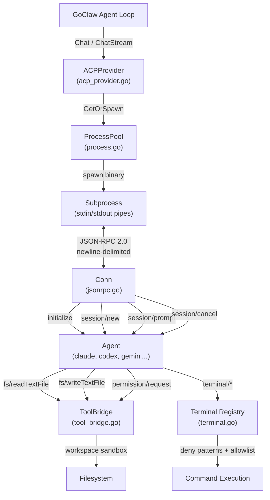
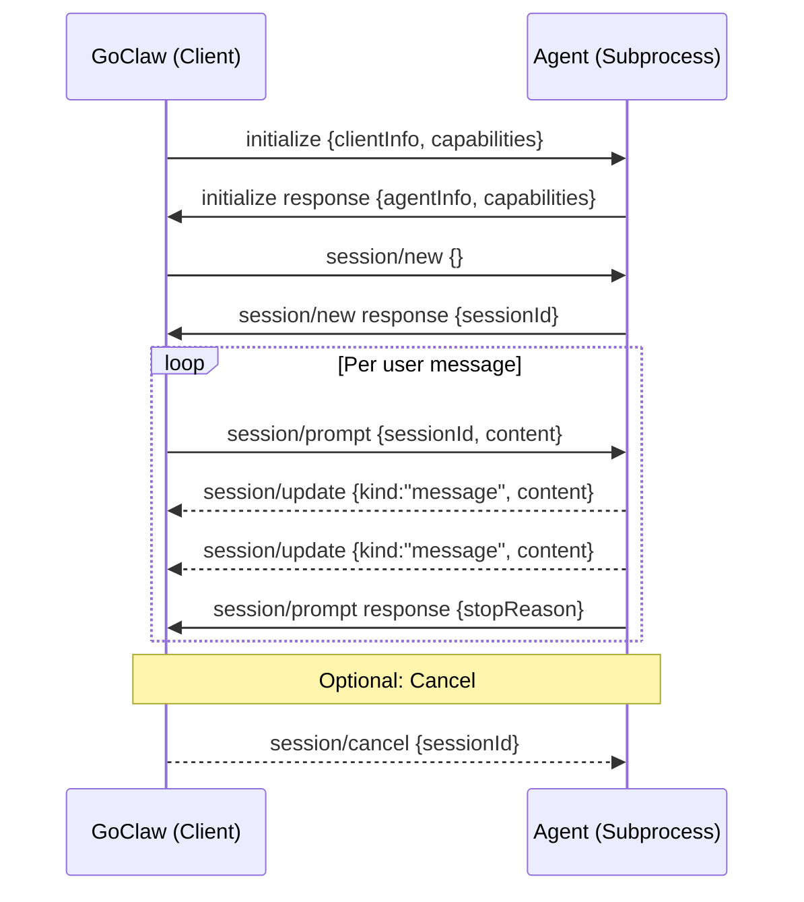

# 18 - ACP Provider (Agent Client Protocol)

The ACP provider enables GoClaw to orchestrate external coding agents (Claude Code, Codex CLI, Gemini CLI, Kiro, or any ACP-compatible agent) as subprocesses via JSON-RPC 2.0 over stdio. One provider type — `acp` — covers all of them: the brand table declares it as wire API `cli-delegated` with CLI kind `acp` (`internal/providers/wire/brand.go`), and the agent binary is part of the provider declaration (`providers.acp.binary` in the config file, or the row's `exec_path` column).

> **References:** [ACP Spec](https://agentclientprotocol.com/) · [ACP Schema](https://github.com/agentclientprotocol/agent-client-protocol/blob/main/schema/schema.json) · Issue [#189](https://github.com/nextlevelbuilder/goclaw/issues/189) · PR [#190](https://github.com/nextlevelbuilder/goclaw/pull/190)

---

## 1. Architecture



**Key principles:**
- GoClaw is an ACP **client** — it spawns and controls agent subprocesses
- Each subprocess is a long-lived OS process communicating via stdin/stdout
- One subprocess per provider declaration (pool key = binary + args) serves every conversation; each GoClaw conversation gets its own ACP session on it
- Security enforced at the tool bridge layer: workspace sandboxing, deny patterns, permission modes

---

## 2. Wire Protocol: JSON-RPC 2.0 over Stdio

### Transport

Messages are **newline-delimited JSON** on stdin/stdout. Each message is a complete JSON object followed by `\n`. The `Conn` type (`jsonrpc.go`, 219 lines) handles bidirectional communication.

```
GoClaw (Client)                     Agent (Server)
     │                                    │
     │──── {"jsonrpc":"2.0","id":1,  ────►│  Request
     │      "method":"initialize",        │
     │      "params":{...}}               │
     │                                    │
     │◄─── {"jsonrpc":"2.0","id":1,  ─────│  Response
     │      "result":{...}}               │
     │                                    │
     │◄─── {"jsonrpc":"2.0",         ─────│  Notification (no id)
     │      "method":"session/update",    │
     │      "params":{...}}               │
     │                                    │
     │◄─── {"jsonrpc":"2.0","id":42, ─────│  Agent→Client Request
     │      "method":"fs/readTextFile",   │
     │      "params":{"path":"..."}}      │
     │                                    │
     │──── {"jsonrpc":"2.0","id":42, ────►│  Client→Agent Response
     │      "result":{"content":"..."}}   │
```

### Message Format

```go
type jsonrpcMessage struct {
    JSONRPC string          `json:"jsonrpc"`         // always "2.0"
    ID      *int64          `json:"id,omitempty"`    // present for requests/responses, absent for notifications
    Method  string          `json:"method,omitempty"`
    Params  json.RawMessage `json:"params,omitempty"`
    Result  json.RawMessage `json:"result,omitempty"`
    Error   *jsonrpcError   `json:"error,omitempty"`
}
```

### Key Conn Methods

| Method | Purpose |
|--------|---------|
| `Call(ctx, method, params, &result)` | Send request, block until response (with context timeout) |
| `Notify(method, params)` | Fire-and-forget notification |
| `Start()` | Spawn `readLoop` goroutine for incoming messages |
| `Done()` | Channel closed when read loop exits (process died) |

**Buffer sizing:** Scanner uses 256KB initial / 10MB max per message — handles large file contents in tool bridge responses.

**ID sequencing:** Atomic `Int64` counter, no lock contention.

---

## 3. Session Lifecycle



### Phase 1: Initialize

Client declares capabilities (filesystem read/write, terminal support). Agent responds with identity and capabilities (audio, image, embedded context).

```go
// Client sends:
InitializeRequest{
    ClientInfo: ClientInfo{Name: "goclaw", Version: "1.0"},
    Capabilities: ClientCaps{
        Fs:       &FsCaps{Read: true, Write: true},
        Terminal: &TerminalCaps{Create: true},
    },
}
```

### Phase 2: New Session

Creates an isolated session on the agent. Returns `sessionId` used in all subsequent prompt calls.

### Phase 3: Prompt Loop

Send user content blocks (text + images). Agent streams `session/update` notifications with message deltas, tool call progress, and plan updates. Prompt completes with a response containing `stopReason`.

### Phase 4: Cancel (Optional)

Cooperative cancellation via `session/cancel` notification. Agent may take time to stop.

---

## 4. Content Handling

### ContentBlock Types

```go
type ContentBlock struct {
    Type     string `json:"type"`               // "text", "image", "audio"
    Text     string `json:"text,omitempty"`      // text content
    Data     string `json:"data,omitempty"`      // base64 for image/audio
    MimeType string `json:"mimeType,omitempty"`  // e.g. "image/png"
}
```

### Request Extraction (GoClaw → Agent)

1. Extract system prompt + user message from `ChatRequest.Messages`
2. Prepend system prompt to first user message (ACP has no separate system message API)
3. Attach images as separate content blocks with base64 data

### Response Collection (Agent → GoClaw)

1. Accumulate `SessionUpdate` notifications during prompt execution
2. Collect text blocks into response content string
3. Map `stopReason` to GoClaw finish reason:
   - `"maxContextLength"` → `"length"`
   - All others → `"stop"`

### SessionUpdate Structure

```go
type SessionUpdate struct {
    Kind    string         `json:"kind"`    // "message", "toolCall", "plan"
    Content []ContentBlock `json:"content,omitempty"`
    ToolCall *ToolCallUpdate `json:"toolCall,omitempty"`
}

type ToolCallUpdate struct {
    ID      string         `json:"id"`
    Name    string         `json:"name"`
    Status  string         `json:"status"`  // "running", "completed"
    Content []ContentBlock `json:"content,omitempty"`
}
```

---

## 5. Process Pool

`ProcessPool` (`process.go`, 327 lines) manages subprocess lifecycle. One process is shared across conversations: the pool key is the agent binary plus its spawn args (`ACPProvider.poolKey`), and each GoClaw conversation multiplexes its own ACP session over that process.

### Spawn Flow

```
GetOrSpawn(ctx, poolKey)              // poolKey = binary + args
  ├→ Acquire per-key spawn mutex (sync.Map of mutexes)
  ├→ Check cached process (sync.Map)
  │   ├→ Found, not exited → return
  │   └→ Found, exited → drop it, spawn a replacement
  └→ spawn():
      ├→ exec.CommandContext(binary, args...)
      ├→ cmd.Dir = workDir
      ├→ cmd.Env = filterACPEnv(os.Environ())  // strip secrets
      ├→ Create stdin/stdout pipes
      ├→ cmd.Stderr = limitedWriter(4KB)
      ├→ cmd.Start()
      ├→ NewConn(stdin, stdout, toolBridge.Handle, notifyHandler)
      ├→ conn.Start()  // begin readLoop
      ├→ Initialize()  // ACP handshake
      ├→ Monitor exit in background goroutine (logs collected stderr)
      └→ Store in pool
```

`spawn()` does **not** create a session: `session/new` (or `session/load`) is issued per conversation by `ACPProvider.resolveSession`, which keeps a `goclawSessionKey → ACP session ID` map and a per-key mutex.

### Idle Reaping

Every 30 seconds, the reaper checks all processes:

```go
for each process in pool:
    if proc.inUse.Load() > 0: skip        // active prompt running
    if time.Since(lastActive) > idleTTL:
        proc.cancel()                     // cancels the process context, killing cmd
        remove from pool
```

### Crash Recovery

If a process exits unexpectedly, the goroutine watching `cmd.Wait()` closes `proc.exited` and the connection's read loop closes `Conn.done`, so an in-flight `Call` fails with `connection closed`. The next `GetOrSpawn` sees the exited process, drops it, and spawns a replacement; `resolveSession` then restores the conversation's ACP session with `session/load` when the agent advertised the `LoadSession` capability, and otherwise creates a new session.

### Concurrency Controls

| Mechanism | Purpose |
|-----------|---------|
| `sync.Map` for processes | Lock-free access, keyed by pool key (binary + args) |
| Per-key spawn mutex | Prevent duplicate spawns for the same pool key |
| `inUse` atomic counter | Reaper skips processes with an active prompt |
| `lastActive` timestamp | Tracks idle time for reaping |
| Per-conversation session mutex (`ACPProvider.sessionMu`) | Serializes ACP session create/restore for one GoClaw session |
| Session reaper (`ACPProvider.sessionReaper`) | Every 5 minutes, cancels and drops sessions idle for more than 30 minutes |

---

## 6. Tool Bridge (Agent → Client Requests)

`ToolBridge` (`tool_bridge.go`, 204 lines) handles all agent-initiated requests with security enforcement.

### Request Routing

| Method | Handler | Description |
|--------|---------|-------------|
| `fs/readTextFile` | `readFile()` | Read file within workspace |
| `fs/writeTextFile` | `writeFile()` | Write file within workspace |
| `terminal/createTerminal` | `createTerminal()` | Spawn command subprocess |
| `terminal/terminalOutput` | `terminalOutput()` | Get current output |
| `terminal/waitForTerminalExit` | `waitForExit()` | Block until exit (10-min timeout) |
| `terminal/releaseTerminal` | `releaseTerminal()` | Clean up resources |
| `terminal/killTerminal` | `killTerminal()` | Force-terminate |
| `permission/request` | `handlePermission()` | Permission check |

### Permission Modes

| Mode | Reads | Writes | Terminal | Permission Requests |
|------|-------|--------|----------|-------------------|
| `approve-all` | ✅ | ✅ | ✅ | ✅ (default) |
| `approve-reads` | ✅ | ❌ | ❌ | Per-type |
| `deny-all` | ❌ | ❌ | ❌ | ❌ |

### Workspace Sandbox

All file paths validated via `resolvePath()`:

```go
func resolvePath(path string) (string, error) {
    abs := filepath.Join(workspace, path)
    real, _ := filepath.EvalSymlinks(abs)  // resolve symlinks
    if !strings.HasPrefix(real, workspace) {
        slog.Warn("security.acp_path_escape", ...)
        return "", fmt.Errorf("path outside workspace")
    }
    return real, nil
}
```

Symlink resolution prevents `../../etc/passwd` attacks even when symlinks point outside workspace.

---

## 7. Terminal System

`Terminal` (`terminal.go`, 212 lines) manages command execution within the tool bridge.

### Security Layers

**1. Binary Allowlist (64 binaries):**
```
sh, bash, zsh, fish, node, python, python3, ruby, perl, go,
cargo, rustc, gcc, g++, make, git, ls, cat, head, tail, grep,
rg, find, wc, sort, uniq, diff, patch, mkdir, cp, mv, touch,
echo, printf, env, which, whoami, npm, npx, pnpm, yarn, bun,
pip, pip3, uv, pipx, docker, kubectl, curl, wget, jq, yq, tar,
gzip, unzip, sed, awk, xargs, tee, tr, cut, test, true, false
```

**2. Deny Patterns:** The patterns supplied at construction — `tools.ResolveDenyPatterns(shellDenyGroups)`, i.e. the shell deny groups resolved from config (with no overrides this is exactly `tools.DefaultDenyPatterns()`) — are applied to the full command string (binary + args).

**3. Working Directory Sandbox:** Terminal `cwd` validated against workspace boundary.

### cappedBuffer

Thread-safe circular buffer that retains only the last N bytes (default 10MB):

```go
type cappedBuffer struct {
    mu   sync.Mutex
    data []byte
    max  int
}
// On overflow: keeps tail (recent output), discards head
```

Used for both stdout and stderr capture. Prevents unbounded memory growth from verbose agent output.

---

## 8. Environment Filtering

Before spawning any agent subprocess, `filterACPEnv()` strips sensitive environment variables. Keys are upper-cased before matching, and an explicitly allowed key wins over the prefix rules.

**Prefix-based (24 prefixes):**
```
GOCLAW, CLAUDE, ANTHROPIC, OPENAI, DATABASE, POSTGRES, MYSQL,
REDIS, MONGO, AWS_, AZURE_, GOOGLE_, GCP_, GITHUB_, GH_,
GITLAB_, BITBUCKET_, DOCKER_, REGISTRY_, STRIPE_, TWILIO_,
SENDGRID_, SSH_, GPG_
```

**Exact-match (13 keys):**
```
DB_DSN, PGPASSWORD, PGUSER, PGHOST, NPM_TOKEN,
NPM_CONFIG_TOKEN, HOMEBREW_GITHUB_API_TOKEN, CODECOV_TOKEN,
COVERALLS_REPO_TOKEN, SENTRY_DSN, SENTRY_AUTH_TOKEN,
SECRET_KEY, JWT_SECRET
```

**Allowed passthrough (4 keys):** `GOOGLE_API_KEY`, `GOOGLE_APPLICATION_CREDENTIALS`, `GOOGLE_CLOUD_PROJECT`, `GCP_PROJECT` — they match the `GOOGLE_`/`GCP_` prefixes but the Google/Gemini agent needs them.

This prevents credential leakage to untrusted agent binaries.

---

## 9. Configuration

### Config File (config.json)

```json5
{
  "providers": {
    "acp": {
      "binary": "claude",        // agent binary name or path (must resolve via exec.LookPath)
      "args": ["--profile", "goclaw"],  // optional spawn args
      "model": "claude",         // default model/agent name reported by the provider
      "work_dir": "/workspace",  // base workspace directory
      "idle_ttl": "5m",          // process idle timeout
      "perm_mode": "approve-all" // "approve-all" (default) | "approve-reads" | "deny-all"
    }
  }
}
```

The config path registers the provider under the fixed name `acp`, checks `exec.LookPath(binary)` only (no binary allowlist), defaults `idle_ttl` to 5m, and defaults `work_dir` to `<data dir>/acp-workspaces`.

### Database Registration

Create via Providers API or Web UI. An ACP row is a declaration, not a credential: it names the wire protocol, the auth shape and the agent executable, and carries no API key.

| Field | Value |
|-------|-------|
| `provider_type` | `"acp"` — the brand label |
| `wire_api` | `"cli-delegated"` — derived from the brand when the row does not state it (`store.NormalizeProviderDeclaration`) |
| `auth_kind` | `"cli_delegated"` — derived from the wire protocol (subprocess transports authenticate by delegation) |
| `exec_path` | Agent binary name or absolute path (`"claude"`, `"/usr/local/bin/codex"`) |
| `api_base` | Legacy location of the same value; still read as a one-release fallback when `exec_path` is empty (`cliExecPath`) |
| `settings` | `{"args": [...], "idle_ttl": "5m", "perm_mode": "approve-all", "work_dir": "..."}` |
| `settings_version` | `1` (`store.CurrentSettingsVersion`) |

Binary validation for DB rows: only `claude`, `codex`, `gemini`, or an absolute path is accepted, and the value must resolve via `exec.LookPath()`. A row that fails either check is logged (`security.acp: invalid binary path from DB`, `acp: binary not found, skipping`) and skipped — registration continues without it. The Providers API verify endpoint applies the same allowlist.

Malformed `settings` JSON is logged and treated as defaults. `idle_ttl` defaults to 5m, `perm_mode` to `approve-all` (the tool-bridge default), and `work_dir` to `<data dir>/acp-workspaces` where the data dir is `GOCLAW_DATA_DIR` or `~/.goclaw/data`.

### Gateway Wiring

Both paths assemble a `wire.CLISettings` and hand it to the wire registry, which owns the ACP-vs-Claude-CLI decision via the brand's CLI kind:

```go
// Config-based: cmd/gateway_providers.go (registerACPFromConfig)
registerConfigProvider(registry, wire.Config{
    API:          wire.CLIDelegated,
    Source:       wire.SourceConfig,
    Name:         "acp",
    ProviderType: store.ProviderACP,
    CLI: &wire.CLISettings{Path: cfg.Binary, Model: cfg.Model, Args: cfg.Args, ...},
})

// DB-based: cmd/gateway_providers.go (registerACPFromDB)
prov, err := wire.Build(wire.Config{
    API:          wire.CLIDelegated,
    Source:       wire.SourceDB,
    Name:         p.Name,
    ProviderType: p.ProviderType,
    CLI:          cli, // built by acpCLISettings(p, shellDenyPatterns)
})
```

`wire.Build` → `buildCLIDelegated` (`internal/providers/wire/build.go`) then constructs the provider for CLI kind `acp`:

```go
providers.NewACPProvider(cli.Path, cli.Args, cli.WorkDir, cli.IdleTTL, cli.DenyPatterns,
    providers.WithACPName(cli.Name),
    providers.WithACPModel(cli.Model),
    providers.WithACPPermMode(cli.PermMode))
```

| | Config path | DB path |
|---|---|---|
| Registered name | `acp` | the row's `name` |
| Default model | `providers.acp.model` (empty → `claude`) | the row's `name` |
| Binary check | `exec.LookPath` only | allowlist (`claude`/`codex`/`gemini`/absolute) + `exec.LookPath` |
| Deny patterns | resolved shell deny groups from config | resolved shell deny groups from config |

Deny patterns are `tools.ResolveDenyPatterns(shellDenyGroups)` — the configured shell deny groups, defaults included.

### Live Reload

Provider create/update/delete publishes a provider-kind cache invalidation (`protocol.EventCacheInvalidate` with `bus.CacheKindProvider`). The gateway subscriber (`cmd/gateway_managed.go`) resolves the provider by name, ignores rows whose `provider_type` is not `acp`, unregisters the previous instance (closing its `ProcessPool`, which cancels the subprocess), and re-registers from the row when it is still enabled. The Providers API skips in-memory registration for ACP rows on purpose ("ACP providers are registered via gateway_providers.go on startup or restart"), so this bus path is what makes a Web UI change take effect without a gateway restart.

---

## 10. Streaming vs Non-Streaming

### Chat (Non-Streaming)

```go
func (p *ACPProvider) Chat(ctx, req) → *ChatResponse
```

1. `GetOrSpawn(ctx, poolKey)` — the shared process (pool key = binary + args)
2. Resolve the ACP session for this GoClaw session (`resolveSession`: per-session mutex, `session/load` when the agent supports it, else `session/new`)
3. `Prompt(content, onUpdate)` — blocks until complete
4. Collect text deltas from each `SessionUpdate` into a `strings.Builder`
5. Return `ChatResponse{Content: text, FinishReason: mapped}`

### ChatStream

```go
func (p *ACPProvider) ChatStream(ctx, req, onChunk) → *ChatResponse
```

1. `GetOrSpawn(ctx, poolKey)` — the shared process
2. Resolve the ACP session for this GoClaw session
3. Set up cancel listener (`session/cancel` on context cancellation)
4. `Prompt(content, onUpdate)` with callback:
   - Extract text blocks from each `SessionUpdate`
   - Emit `StreamChunk{Content: delta}` via `onChunk`
5. On completion: emit `StreamChunk{Done: true}`
6. Return accumulated `ChatResponse`

---

## 11. Error Handling

| Scenario | Behavior |
|----------|----------|
| Binary not found | Log warning, skip provider registration |
| Subprocess crash mid-prompt | Active prompt fails; next `GetOrSpawn` respawns |
| Malformed JSON-RPC | Log debug, skip message, continue reading |
| Path escape attempt | Log `security.acp_path_escape`, return error to agent |
| Terminal binary not in allowlist | Return error to agent |
| Terminal deny pattern match | Return error to agent |
| Context cancelled (ChatStream) | Send `session/cancel`, return partial response |
| Idle timeout | Reaper kills process; respawned on next request |
| Permission denied | Return error based on `perm_mode` |
| Large output (>10MB terminal) | cappedBuffer retains tail only |

---

## 12. File Reference

| File | Lines | Purpose |
|------|-------|---------|
| `internal/providers/acp_provider.go` | 382 | Provider interface: Chat, ChatStream, session routing, session reaper |
| `internal/providers/acp/types.go` | 208 | ACP protocol types: Initialize, Session, ContentBlock |
| `internal/providers/acp/jsonrpc.go` | 219 | Bidirectional JSON-RPC 2.0 over stdio |
| `internal/providers/acp/process.go` | 327 | Process pool: spawn (initialize handshake), reap, crash recovery |
| `internal/providers/acp/session.go` | 110 | Session lifecycle: initialize → new/load → prompt → cancel |
| `internal/providers/acp/tool_bridge.go` | 204 | Agent→client request handler with sandbox |
| `internal/providers/acp/terminal.go` | 212 | Terminal subprocess lifecycle + cappedBuffer |
| `internal/providers/acp/helpers.go` | 114 | Environment filtering, session context, limitedWriter |
| `internal/providers/acp/sysproc_linux.go` | 11 | Linux process attributes (`Pdeathsig`) |
| `internal/providers/acp/sysproc_other.go` | 9 | Non-Linux `sysProcAttr()` stub |
| `internal/providers/wire/brand.go` | — | `acp` brand: wire API `cli-delegated`, CLI kind `acp` |
| `internal/providers/wire/build.go` | — | `buildCLIDelegated`: constructs `NewACPProvider` from `wire.CLISettings` |
| `internal/config/config_channels.go` | — | `ACPConfig` struct definition |
| `internal/store/provider_store.go` | — | `ProviderACP = "acp"` constant + declaration validation/defaults |
| `cmd/gateway_providers.go` | — | Config + DB registration wiring (`registerACPFromConfig`, `registerACPFromDB`, `acpCLISettings`) |

---

## Cross-References

| Document | Relevant Content |
|----------|-----------------|
| [02-providers.md](./02-providers.md) | ACP overview section (§10) |
| [03-tools-system.md](./03-tools-system.md) | Shell deny patterns reused by ToolBridge |
| [09-security.md](./09-security.md) | Defense-in-depth layers |
| [01-agent-loop.md](./01-agent-loop.md) | Chat/ChatStream provider contract |
